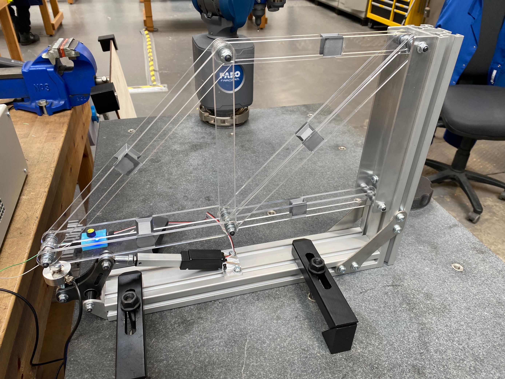
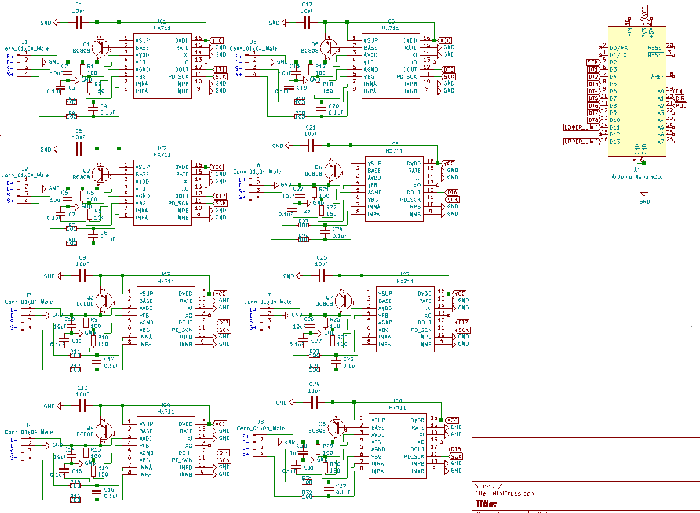
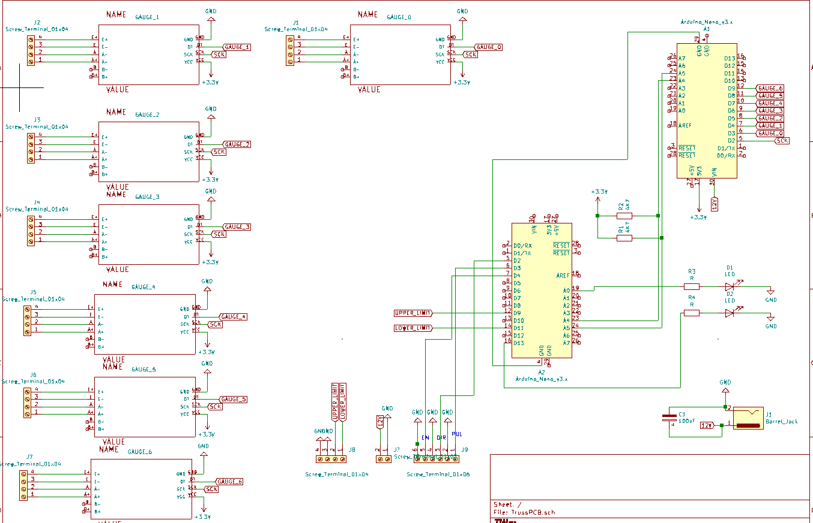

# truss-firmware

Firmware for controlling and reading a 6 member truss. Each member has a full bridge strain gauge arrangement. Strain gauge voltages are converted to digital signals using the HX711 ADC. The truss is loaded using a servo controlled by the firmware.

Truss remote lab UI available [here](https://github.com/dpreid/truss-ui)

# mini-truss remote lab (in development)

The mini-truss remote lab firmware uses a state machine with 8 states for reading, writing, loading, taring and resetting both strain gauges and load cell. A single microcontroller performs both reading and writing of data. 

# Large truss (single, prototype)

The prototype large truss uses very similar firmware to the mini-truss except it utilises 2 microcontrollers - one is dedicated to reading the gauge values; the other acts as the state machine for all other functions. Potential issues with the Arduino I2C communications resulted in the simplification down to a single microcontroller for the mini-truss experiments.

